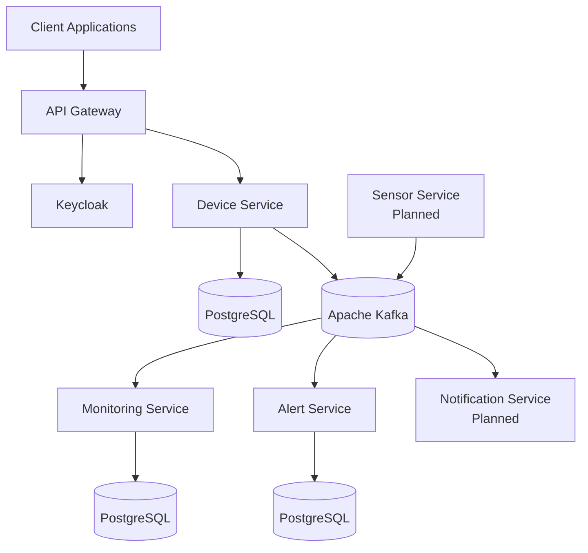
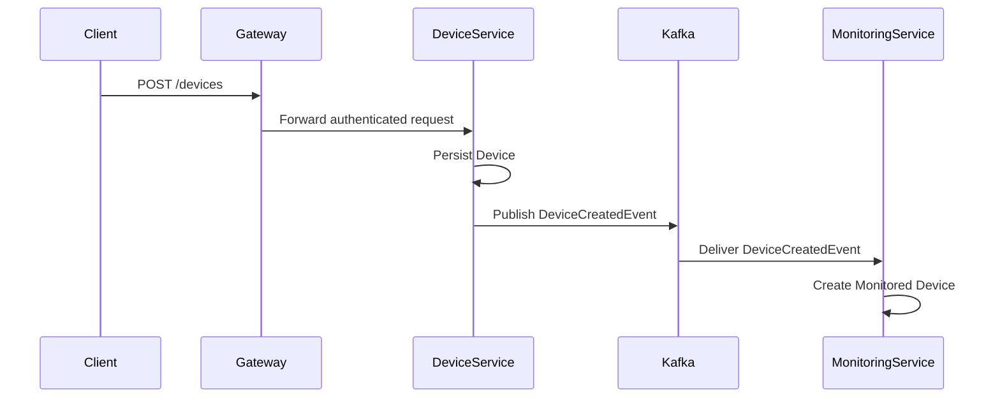

<div align="center">

# 🏙️ Smart City Platform

**A cloud-native, event-driven platform for managing connected urban devices**

[](https://openjdk.org/projects/jdk/21/)
[](https://spring.io/projects/spring-boot)
[](https://kafka.apache.org/)
[](https://www.keycloak.org/)
[](https://www.postgresql.org/)
[](https://www.docker.com/)
[]()

</div>

---

## 📖 Overview

The **Smart City Platform** is a distributed system built with Java and Spring Boot, designed to simulate the management and monitoring of connected devices deployed across a smart city environment.

The platform demonstrates how independent microservices collaborate through **asynchronous communication** using Apache Kafka, while remaining loosely coupled, secure, and scalable.

### Key Concepts

- 🔐 **Secure API exposure** via API Gateway and OAuth2 / JWT authentication
- ⚡ **Event-driven communication** between services using Apache Kafka
- 🗄️ **Independent persistence** layers per microservice
- 🔄 **Data projection** and eventual consistency patterns
- 📊 **Monitoring and alerting** workflows
- 🐳 **Containerized** and production-oriented deployment

---

## 🏗️ Architecture



---

## 📡 Event Flow — Device Registration



---

## 🧩 Services

| Service | Responsibility | Status |
|---|---|---|
| **API Gateway** | Entry point and request routing | ✅ Implemented |
| **Device Service** | Device management and event publication | ✅ Implemented |
| **Monitoring Service** | Device projection and monitoring views | ✅ Implemented |
| **Alert Service** | Alert generation and lifecycle management | ✅ Implemented |
| **Notification Service** | User notifications | 🔜 Planned |
| **Sensor Service** | Sensor data generation | 🔜 Planned |

---

## ✅ Implemented Features

### 🔐 Security
- OAuth2 Resource Server configuration
- JWT authentication through Keycloak
- Centralized entry point via Spring Cloud Gateway

### 📦 Device Service
- Device creation API
- Device persistence with PostgreSQL
- Database migrations with Flyway
- Domain event publication through Kafka

### 📊 Monitoring Service
- `DeviceCreatedEvent` consumption
- Monitored device projection creation
- Dedicated persistence layer
- APIs for monitored device consultation

### 🔗 Shared Contracts
- Common event models shared across services
- Separation between domain entities and messaging contracts

### 🐳 Infrastructure
- Dockerized local environment
- Kafka-based asynchronous communication
- Independent databases per microservice

---

## 🚧 Roadmap

- [ ] Sensor Service for telemetry generation
- [ ] `SensorReadingEvent` processing
- [ ] Alert rule engine
- [ ] Alert notification workflows
- [ ] Notification Service
- [ ] Prometheus metrics integration
- [ ] Grafana dashboards
- [ ] OpenTelemetry distributed tracing
- [ ] CI/CD pipelines (GitHub Actions)
- [ ] Integration and contract testing

---

## 🛠️ Technology Stack

### Backend
| Technology | Role |
|---|---|
| Java 21 | Runtime |
| Spring Boot | Application framework |
| Spring Data JPA | Data access |
| Spring Security | Security layer |
| Spring Cloud Gateway | API Gateway |
| Spring Kafka | Kafka integration |
| MapStruct | Object mapping |
| Lombok | Boilerplate reduction |

### Security & Messaging
| Technology | Role |
|---|---|
| Keycloak | Identity provider |
| OAuth2 / JWT | Authentication & authorization |
| Apache Kafka | Event streaming |

### Persistence & Infrastructure
| Technology | Role |
|---|---|
| PostgreSQL | Relational database |
| Flyway | Database migrations |
| Docker / Docker Compose | Containerization |

### Planned Additions
`Prometheus` · `Grafana` · `OpenTelemetry` · `GitHub Actions`

---

## 🚀 Getting Started

### Prerequisites

- [Java 21](https://openjdk.org/projects/jdk/21/)
- [Maven 3.9+](https://maven.apache.org/)
- [Docker Desktop](https://www.docker.com/products/docker-desktop/)

### Installation

**1. Clone the repository**

```bash
git clone https://github.com/your-username/smart-city-platform.git
cd smart-city-platform
```

**2. Start the infrastructure**

```bash
docker compose up -d
```

**3. Start the services**

Each service can be launched independently:

```bash
mvn spring-boot:run
```

Or directly from your IDE.

---

## 🧪 Validated End-to-End Capabilities

The following flows have already been tested and validated:

- ✅ User authentication through Keycloak
- ✅ Request routing through the API Gateway
- ✅ Device creation through secured endpoints
- ✅ Device persistence in PostgreSQL
- ✅ Kafka event publication from Device Service
- ✅ Kafka event consumption by downstream services
- ✅ Monitoring projection creation

---

## 🎓 Learning Objectives

This project is designed to deepen practical knowledge of:

- Microservices architecture
- Event-driven systems
- Domain decomposition
- Distributed security
- Eventual consistency
- Cloud-native application development
- Production-ready backend practices

---

## ⚠️ Disclaimer

This repository is intended for **educational and portfolio purposes**. While production-oriented practices are being adopted, some components are still evolving as the platform matures.
